# 🤖 AI Powered Code Reviewer and Quality Assistant

A comprehensive Python code analysis tool that leverages AI to automatically generate, validate, and improve docstrings while providing deep insights into code quality metrics.


---

## ✨ Features

### 🔍 AST-Based Code Parsing
- Deep analysis of Python source files using Abstract Syntax Tree (AST)
- Extracts function signatures, parameters, return types, and class definitions
- Identifies generators, async functions, and exception handling patterns

### 🤖 AI-Powered Docstring Generation
- Automatic docstring generation using Groq LLM (LLaMA 3.1 8B Instant)
- Support for multiple docstring styles:
  - **Google Style** - Clean and readable
  - **NumPy Style** - Scientific computing standard
  - **reST Style** - Sphinx documentation compatible
- Smart caching to reduce API calls and improve performance
- Hallucination prevention with intelligent post-processing

### ✅ PEP 257 Validation & Auto-Fix
- Comprehensive docstring validation using `pydocstyle`
- Automatic fixing of common violations:
  - D400: First line period enforcement
  - D401: Imperative mood correction
  - D403: Proper capitalization
  - D404: "This" word removal
- One-click "Fix All Violations" functionality

### 📊 Code Quality Metrics
- **Cyclomatic Complexity Analysis** using Radon
- **Docstring Coverage Reports** with visual indicators
- **Per-file and per-function breakdown**

### 🎨 Modern Dashboard UI
- Beautiful Streamlit-based interface
- Dark/Light mode support
- Interactive tabs for different workflows:
  - **Generated Docstrings** - View and manage AI-generated documentation
  - **Validator** - Check PEP 257 compliance
  - **Search** - Find functions across your codebase
  - **Export** - Download reports in JSON format
  - **Tests** - Run and visualize test results
  - **Help & Tips** - Usage guidance

---

## 🚀 Getting Started

### Prerequisites

- Python 3.14
- [Groq API Key](https://console.groq.com/) (Free tier available)

### Installation

1. **Clone the repository**
   ```bash
   git clone https://github.com/Agniva101/AI-Powered-Code-Reviewer-and-Quality-Assistant.git
   cd AI-Powered-Code-Reviewer-and-Quality-Assistant
   ```

2. **Create a virtual environment** (recommended)
   ```bash
   python -m venv venv
   
   # Windows
   venv\Scripts\activate
   
   # macOS/Linux
   source venv/bin/activate
   ```

3. **Install dependencies**
   ```bash
   pip install -r requirements.txt
   ```

4. **Configure environment variables**
   
   > [!IMPORTANT]
   > You must configure your Groq API key to enable AI-powered features.
   
   Create a `.env` file in the project root (or rename `.env.example` to `.env`):
   
   ```env
   GROQ_API_KEY="your-groq-api-key-here"
   ```
   
   Get your free API key from [Groq Console](https://console.groq.com/).

5. **Run the application**
   ```bash
   streamlit run main_app.py
   ```
   
   The application will open in your default browser at `http://localhost:8501`

---

## 📖 Usage

### Quick Start

1. **Set the scan path**: Enter the path to your Python project or use the "Use examples folder" button
2. **Select docstring style**: Choose between Google, NumPy, reST, or None
3. **Click Scan**: The tool will parse all Python files and analyze their structure
4. **Review results**: Navigate through the tabs to see generated docstrings, validation results, and metrics

### Workflow

```mermaid
graph LR
    A[📁 Select Path] --> B[🔍 Scan Files]
    B --> C[📊 View Analysis]
    C --> D[🤖 Generate Docstrings]
    D --> E[✅ Validate PEP 257]
    E --> F[🔧 Auto-Fix Issues]
    F --> G[💾 Export Results]
```



---

## 🏗️ Project Structure

```
Python Project/
├── main_app.py              # Main Streamlit application
├── requirements.txt         # Python dependencies
├── .env                     # Environment variables (create from .env.example)
│
├── core/                    # Core modules
│   ├── docstring_engine/    # AI docstring generation
│   │   └── generator.py     # Groq LLM integration & templating
│   ├── parser/              # AST parsing utilities
│   │   └── python_parser.py # Function/class extraction
│   ├── validator/           # Code quality validation
│   │   └── validator.py     # pydocstyle & radon integration
│   ├── reporter/            # Coverage reporting
│   │   └── coverage_reporter.py
│   ├── dashboard/           # UI components
│       └── dashboard.py     # Tab rendering & interactions
│
├── tests/                   # Test suite
│   ├── test_generator.py
│   ├── test_parser.py
│   ├── test_validator.py
│   └── ...
│
├── examples/                # Sample Python files for demo
├── storage/                 # Output files and logs
│   └── reports/             # Generated reports
└── static/                  # CSS and static assets
```

---

## ⚙️ Configuration

### Environment Variables

| Variable | Description | Required |
|----------|-------------|----------|
| `GROQ_API_KEY` | Your Groq API key for LLM access | ✅ Yes |

### Docstring Style Options

| Style | Best For |
|-------|----------|
| **Google** | General purpose, high readability |
| **NumPy** | Scientific/data science projects |
| **reST** | Sphinx documentation generation |
| **None** | Skip docstring generation |

---

## 🧪 Running Tests

The project includes a comprehensive test suite:

```bash
# Run all tests
pytest

# Run with verbose output
pytest -v

# Generate JSON report
pytest --json-report --json-report-file=storage/reports/pytest_results.json
```

---

## 🛠️ Technologies Used

### Core Framework
- **[Streamlit](https://streamlit.io/)** - Web application framework

### AI & LLM
- **[Groq API](https://groq.com/)** - Ultra-fast LLM inference API
- **[LangChain](https://langchain.com/)** - LLM orchestration framework
- **[LangChain-Groq](https://python.langchain.com/docs/integrations/chat/groq/)** - Groq integration for LangChain
- **[LangChain-Community](https://python.langchain.com/)** - Community integrations

### Code Analysis
- **[pydocstyle](https://www.pydocstyle.org/)** - PEP 257 docstring validation
- **[Radon](https://radon.readthedocs.io/)** - Code complexity metrics

### Visualization
- **[Altair](https://altair-viz.github.io/)** - Declarative statistical visualizations

### Testing
- **[pytest](https://pytest.org/)** - Testing framework
- **[pytest-json-report](https://pypi.org/project/pytest-json-report/)** - JSON test report generation

### Utilities
- **[python-dotenv](https://pypi.org/project/python-dotenv/)** - Environment variable management

---

## 📝 License

This project is licensed under the MIT License - see the [LICENSE](LICENSE) file for details.

---

## 👤 Author

**Agniva Bhattacharya**

---

## 🤝 Contributing

Contributions are welcome! Please feel free to submit a Pull Request.

1. Fork the repository
2. Create your feature branch (`git checkout -b feature/AmazingFeature`)
3. Commit your changes (`git commit -m 'Add some AmazingFeature'`)
4. Push to the branch (`git push origin feature/AmazingFeature`)
5. Open a Pull Request

---

## 📬 Support

If you encounter any issues or have questions, please [open an issue](https://github.com/Agniva101/AI-Powered-Code-Reviewer-and-Quality-Assistant/issues) on GitHub.

---

<div align="center">

**Made with ❤️ by Agniva Bhattacharya**

</div>
